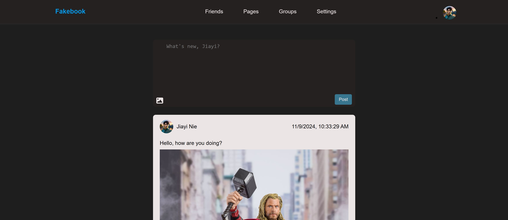

# Fakebook

**Fakebook** is a simple, front-end social media application designed to allow users to post updates, view their posts, and manage profile information. This project is built with HTML, CSS, and JavaScript, focusing on core front-end skills and interactions.

## Table of Contents

- [Demo](#demo)
- [Features](#features)
- [Getting Started](#getting-started)
  - [Installation](#installation)
  - [Usage](#usage)
- [Project Structure](#project-structure)
- [Technologies Used](#technologies-used)
- [Future Improvements](#future-improvements)

## Demo

  

## Features

- **Dynamic Posting**: Users can create text-based posts and upload images, which appear in the feed section.
- **Profile Info Modal**: A modal window displays user information and can be toggled via the profile image.
- **Live Image Preview**: When a user selects an image, it provides an inline preview before posting.

## Getting Started

### Installation

1. Clone the repository:
   ```bash
   git clone [https://github.com/jiayimitt/fakebook]
   ```
2. Navigate to the project folder:
   ```bash
   cd fakebook
   ```
3. Open `index.html` in a browser to view the app.

### Usage

- **View Profile**: Click on the profile image in the header to open a modal with user information.
- **Create a Post**: Use the text area in the main section to write a post. Optionally, attach an image using the upload icon, and click "Post" to publish it.
- **Close Modal**: Click the "X" button or outside the modal to close the profile info modal.

## Project Structure

```plaintext
├── assets
│   ├── css
│   │   └── style.css          # Core styling
│   ├── img                    # Images for profile, logo, etc.
│   └── js
│       └── index.js           # Main JavaScript file for interactions
├── index.html                 # Main HTML file
└── README.md                  # Project documentation
```

## Technologies Used

- **HTML5**: Structure of the application.
- **CSS3**: Styling and layout, including responsiveness.
- **JavaScript**: Core functionality for user interactions, including modal control and post publishing.

## Future Improvements

- **Persistent Data**: Implement a backend or local storage for saving posts across sessions.
- **Comment System**: Allow users to comment on each post.
- **Like Button**: Enable users to "like" posts to increase engagement.
- **User Authentication**: Add login/logout functionality for multiple users.

